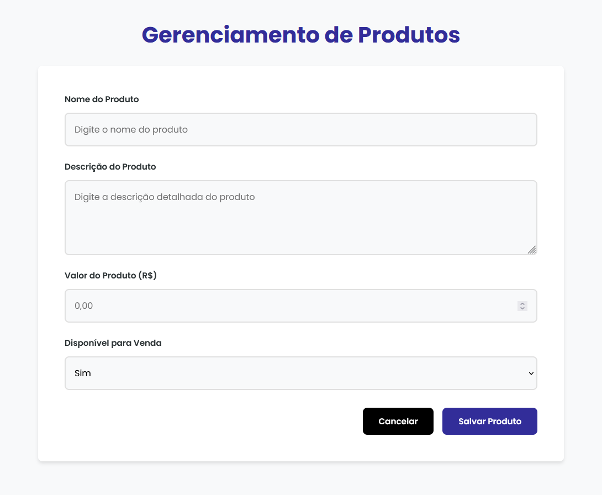
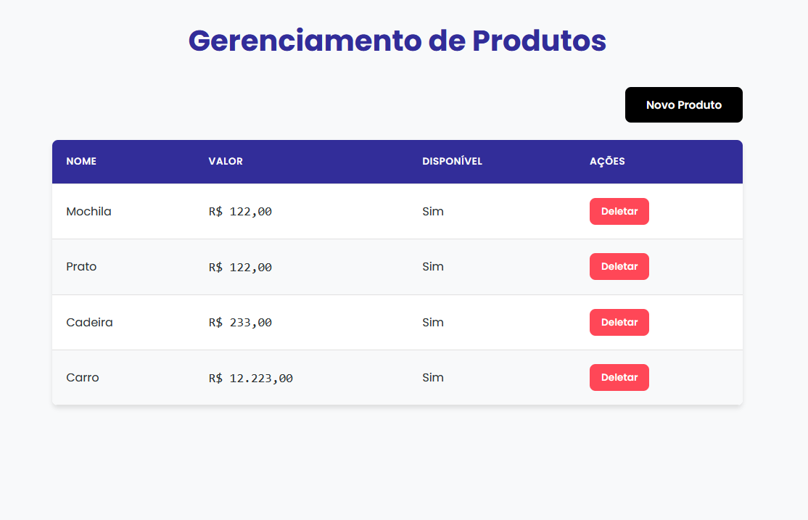

# Cadastro e Listagem de Produtos

Este projeto é uma aplicação simples para o **cadastro e listagem de produtos**, com funcionalidade de gerenciamento básico.

## Funcionalidades

### Cadastro de Produtos

- **Formulário com os campos:**
  - Nome do Produto (campo de texto);
  - Descrição do Produto (campo de texto);
  - Valor do Produto (campo de valor);
  - Disponível para Venda (campo com opções "Sim" ou "Não").
- Após salvar o cadastro, a listagem é exibida automaticamente.

### Listagem de Produtos

- **Colunas exibidas na listagem:**
  - Nome;
  - Valor;
  - Disponível para venda.
- Ordenação dos produtos por valor, do menor para o maior.
- Botão para **deletar** produtos diretamente na listagem.
- Botão para cadastrar um novo produto.

### Funcionalidade Extra

- O formulário inclui um botão "Cancelar", que não foi solicitado nos requisitos iniciais. Ele foi adicionado como uma melhoria opcional para permitir que o usuário retorne à listagem sem salvar o produto em edição. Além do botão deletar.

## Tecnologias Utilizadas

- HTML5
- CSS3
- JavaScript Puro

## Estrutura do Projeto

- **HTML:** Estrutura do formulário de cadastro e da tabela de listagem.
- **CSS:** Estilização responsiva e moderna com o uso de variáveis CSS.
- **JavaScript:** Lógica para cadastro, listagem, ordenação, e deleção de produtos.
